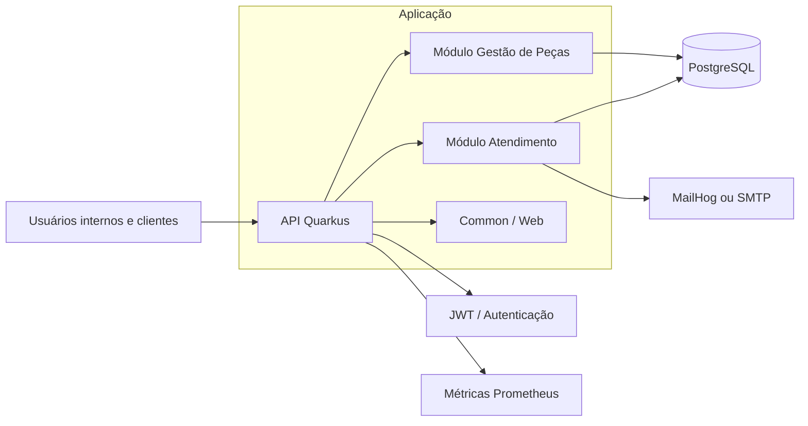

# oficina-app

Aplicação Quarkus da oficina mecânica, organizada como um monólito modular. Este repositório agora faz parte de um conjunto maior de projetos: a infra de banco de dados, a infra de Kubernetes e o domínio administrativo passaram a ser mantidos em repositórios dedicados.

## Escopo deste repositório

Este repositório concentra apenas o que pertence à aplicação:

- código da API e regras de negócio
- módulos de domínio `atendimento` e `gestao_de_pecas`
- componentes compartilhados em `common`
- build, testes e empacotamento da aplicação
- ambiente local com `docker compose`

Itens que não são mais gerenciados aqui:

- provisionamento de infraestrutura cloud ou Terraform
- manifests e operação de Kubernetes
- artefatos do domínio administrativo
- pipelines de deploy da plataforma

## Relação com os demais repositórios

A aplicação depende de contratos e ambientes providos por outros repositórios do ecossistema. Na prática:

- este repositório entrega a API e sua imagem executável
- o repositório de infra de banco gerencia a camada de persistência fora do ambiente local
- o repositório de infra k8s gerencia manifests, configurações de cluster e rollout
- o repositório do domínio administrativo evolui de forma independente, sem compartilhar código de negócio aqui

## Arquitetura

A aplicação segue uma organização em monólito modular com fronteiras de domínio explícitas e uso de Clean Architecture para manter regras de negócio desacopladas dos detalhes de framework e infraestrutura.

Componentes principais:

- `atendimento`: clientes, veículos, ordens de serviço, acompanhamento e magic link
- `gestao_de_pecas`: catálogo de peças e serviços, além do controle de estoque
- `common`: contratos compartilhados e componentes web reutilizados
- integrações de plataforma: PostgreSQL reativo, JWT, e-mail e métricas



## Pré-requisitos

Para desenvolvimento local e execução dos testes:

- Java 25
- Docker e Docker Compose

## Execução local

### Opção 1: modo desenvolvimento com Quarkus

```bash
./mvnw quarkus:dev
```

No perfil `dev`, o projeto usa Dev Services para o banco e mailer mockado.

### Opção 2: stack local completa com Docker Compose

```bash
docker compose up --build
```

Esse fluxo sobe:

- aplicação em `http://localhost:8080`
- Swagger em `http://localhost:8080/q/swagger-ui/`
- PostgreSQL em `localhost:5432`
- MailHog em `http://localhost:8025`

## Testes

Executar testes unitários:

```bash
./mvnw test
```

Executar testes de integração:

```bash
./mvnw verify -DskipITs=false -DskipTests=true
```

Executar o build completo localmente:

```bash
./mvnw clean verify -DskipITs=false
```

## Build da imagem

Para gerar a imagem localmente:

```bash
docker build -t oficina-app .
```

A publicação da imagem em registry e o deploy em ambientes gerenciados devem ser executados pelos repositórios responsáveis pela plataforma e pela operação.
