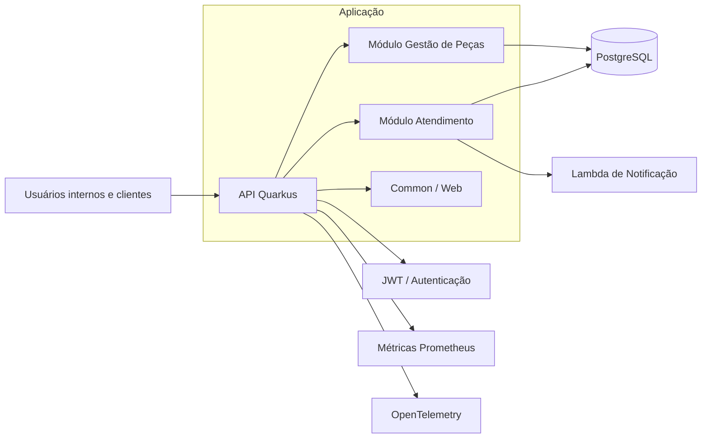

# oficina-app

Aplicação Quarkus da oficina mecânica, organizada como um monólito modular e publicada no laboratório como imagem Docker em ECR com rollout no EKS.

O repositório segue o mesmo ciclo de versionamento do `oficina-auth-lambda`: a versão fechada vem de `project.version` no `pom.xml`, o `push` em `develop` executa os testes e abre PR para `main`, e o deploy só acontece depois que esse PR é aceito.

## Escopo deste repositório

Este repositório concentra apenas o que pertence à aplicação:

- código da API e regras de negócio
- módulos de domínio `atendimento` e `gestao_de_pecas`
- componentes compartilhados em `common`
- build, testes e empacotamento da aplicação
- ambiente local com `docker compose`
- publicação da imagem versionada da aplicação
- rollout do Deployment existente no EKS

Itens que não são mais gerenciados aqui:

- provisionamento de infraestrutura cloud ou Terraform
- manifests e operação de Kubernetes
- artefatos do domínio administrativo
- pipelines de deploy da plataforma

## Relação com os demais repositórios

A aplicação depende de contratos e ambientes providos por outros repositórios do ecossistema. Na prática:

- este repositório entrega a API e sua imagem executável
- o repositório `../oficina-infra-db` gerencia RDS, migrations, seed de laboratório e o secret `oficina-database-env`
- o repositório `../oficina-infra-k8s` gerencia EKS, ECR e API Gateway
- este repositório aplica os manifests mínimos da aplicação quando o Deployment ainda não existe e, nos deploys seguintes, atualiza somente a imagem
- este repositório cria/reaplica o secret Kubernetes `oficina-jwt-keys` a partir do AWS Secrets Manager
- o repositório do domínio administrativo evolui de forma independente, sem compartilhar código de negócio aqui

## Convenções padronizadas com os repos de infra

- ambiente GitHub Actions: `lab`
- nome padrão da infra compartilhada: `eks-lab`
- banco padrão: `oficina-postgres-lab`
- repositório ECR padrão: `oficina`
- Deployment Kubernetes padrão: `default/oficina-app`
- container padrão: `oficina-app`
- tag da imagem: `project.version`
- release GitHub: `v<project.version>`

## Estrutura

- `src/main/java`: domínios, casos de uso, adapters e recursos HTTP
- `src/test/java`: testes unitários e de integração
- `src/main/resources/application.properties`: configuração Quarkus por perfil
- `scripts/build-image.sh`: build local/CI da imagem Docker
- `scripts/push-image.sh`: login no ECR e publicação da imagem
- `scripts/deploy-k8s.sh`: reaplicacao do overlay `lab` e rollout da imagem no EKS
- `scripts/resolve-image-ref.sh`: resolução da URL/tag da imagem no ECR
- `k8s/overlays/lab`: manifests mínimos da aplicação alinhados ao overlay `lab` do repo `oficina-infra-k8s`
- `.github/workflows/ci.yml`: CI/CD principal
- `.github/workflows/redeploy-app-lab.yml`: redeploy manual da imagem versionada
- `docs/github-actions.md`: variáveis, secrets e detalhes dos workflows

## Arquitetura

A aplicação segue uma organização em monólito modular com fronteiras de domínio explícitas e uso de Clean Architecture para manter regras de negócio desacopladas dos detalhes de framework e infraestrutura.

Componentes principais:

- `atendimento`: clientes, veículos, ordens de serviço, acompanhamento e magic link
- `gestao_de_pecas`: catálogo de peças e serviços, além do controle de estoque
- `common`: contratos compartilhados e componentes web reutilizados
- integrações de plataforma: PostgreSQL reativo, JWT, notificação serverless e métricas
- observabilidade vendor-neutral: logs JSON, OpenTelemetry, health probes HTTP e métricas Micrometer



## Observabilidade

Esta fase prepara o serviço para qualquer backend observability compatível com OTLP, sem dependência direta de vendor.

- `service.name=oficina-app`
- `service.namespace=oficina`
- `deployment.environment=lab` por padrão
- logs estruturados em JSON com `request_id`, `trace_id` e `span_id` quando houver contexto
- tracing distribuído com OpenTelemetry para entrada HTTP e integração de notificação
- métricas de negócio:
  - `os_created_total`
  - `os_status_transition_total`
  - `os_status_duration_ms`
  - `integration_failures_total`
  - `integration_latency_ms`
- métricas técnicas em `GET /q/metrics`
- probes internas:
  - `GET /q/health/live`
  - `GET /q/health/ready`

Env vars padronizadas:

- `OTEL_SERVICE_NAME`
- `OTEL_RESOURCE_ATTRIBUTES`
- `OTEL_EXPORTER_OTLP_ENDPOINT`
- `OTEL_EXPORTER_OTLP_PROTOCOL`
- `OTEL_TRACES_EXPORTER`
- `OTEL_METRICS_EXPORTER`
- `OTEL_LOGS_EXPORTER`
- `OFICINA_OBSERVABILITY_ENABLED`
- `OFICINA_OBSERVABILITY_JSON_LOGS_ENABLED`
- `OFICINA_OBSERVABILITY_METRICS_ENABLED`
- `OFICINA_OBSERVABILITY_TRACING_ENABLED`
- `DEPLOYMENT_ENVIRONMENT`

## Pré-requisitos

Para desenvolvimento local e execução dos testes:

- Java 25
- Docker e Docker Compose

## Execução local

### Opção 1: modo desenvolvimento com Quarkus

Gere um par local não versionado para JWT:

```bash
./scripts/generate-dev-jwt-keys.sh
```

Para gerar um token JWT local compatível com o Swagger UI:

```bash
./scripts/generate-dev-jwt-token.sh
```

Por padrão, o script emite um token com os papéis `administrativo`, `mecanico` e `recepcionista`. Para customizar:

```bash
./scripts/generate-dev-jwt-token.sh --subject 36655462007 --roles mecanico
```

```bash
./mvnw quarkus:dev
```

No perfil `dev`, o projeto usa Dev Services para o banco. Para acionar notificações localmente, suba também a `notificacao-lambda` do repositório `../oficina-auth-lambda` com `./mvnw -pl notificacao-lambda quarkus:dev`, ou defina `OFICINA_NOTIFICACAO_BASE_URL`.

### Opção 2: stack local completa com Docker Compose

```bash
docker compose up --build
```

Esse fluxo sobe:

- aplicação em `http://localhost:8080`
- Swagger em `http://localhost:8080/q/swagger-ui/`
- PostgreSQL em `localhost:5432`

## Testes

Executar testes unitários:

```bash
./mvnw test
```

Executar testes de integração:

```bash
./mvnw verify -DskipITs=false
```

Executar o build completo localmente:

```bash
./mvnw clean verify -DskipITs=false
```

## Build da imagem

Para gerar a imagem localmente:

```bash
./scripts/build-image.sh oficina-app:local
```

## Deploy

O deploy automatizado fica em [`.github/workflows/ci.yml`](.github/workflows/ci.yml):

- `develop`: executa testes unitários e de integração e abre PR para `main` quando houver diferença de conteúdo e ainda não existir PR aberto, mesmo quando a release da versão atual já existe
- `main`: cria a imagem Docker, publica no ECR, cria a GitHub Release e executa o rollout no EKS após o merge do PR

Quando a release da versão atual já existe, commits novos continuam passando por testes e PR, mas o merge em `main` não gera build de imagem, release nem deploy. Em `main`, versões fechadas não podem terminar com `-SNAPSHOT` quando houver deploy pendente, e uma versão já publicada não é sobrescrita.

O deploy assume que a infraestrutura base já foi criada pelos repositórios irmãos:

- `../oficina-infra-k8s`: ECR, EKS e API Gateway quando aplicável
- `../oficina-infra-db`: RDS PostgreSQL, migrations, seed e secret `oficina-database-env`

Em todos os deploys, `scripts/deploy-k8s.sh` valida o secret de banco, cria/atualiza o secret `oficina-jwt-keys` e reaplica os manifests do overlay `k8s/overlays/lab` antes do rollout. Quando o Deployment `oficina-app` ainda não existe, o mesmo fluxo faz o bootstrap inicial da aplicação.

Por padrão, o deploy exige o secret `oficina-database-env`, criado pelo `../oficina-infra-db`, porque a aplicação precisa das variáveis `QUARKUS_DATASOURCE_USERNAME`, `QUARKUS_DATASOURCE_PASSWORD` e `QUARKUS_DATASOURCE_REACTIVE_URL` para iniciar no perfil de produção. Para permitir deploy sem banco, configure `REQUIRE_K8S_DB_SECRET=false`.

As chaves JWT não precisam ser cadastradas como GitHub Secrets neste repositório. Por padrão, o deploy usa o AWS Secrets Manager como origem (`JWT_SECRET_NAME=oficina/lab/jwt`) e cria o par RSA se ele ainda não existir. O secret Kubernetes `oficina-jwt-keys` é atualizado a partir desse valor em cada deploy. Para manter compatibilidade com tokens emitidos pelo `oficina-auth-lambda`, o lambda deve usar o mesmo secret do Secrets Manager, ou esse secret deve ser criado previamente com o par de chaves já usado pelo lambda. No ambiente `lab`, o deploy tenta descobrir `OFICINA_AUTH_ISSUER` pelo HTTP API padrão `<EKS_CLUSTER_NAME>-http-api`, ou pelos overrides `API_GATEWAY_ID` e `API_GATEWAY_NAME`. Se `OFICINA_AUTH_JWKS_URI` ficar vazio e o issuer for HTTP(S), o deploy deriva automaticamente `https://.../.well-known/jwks.json`. Quando encontrar a configuração legada `OFICINA_AUTH_ISSUER=oficina-api` com `OFICINA_AUTH_JWKS_URI=file:/jwt/publicKey.pem`, o script migra automaticamente para o issuer público do gateway para evitar divergência com os tokens emitidos pela lambda. A integração de notificação usa o mesmo host por padrão e pode ser sobrescrita com `OFICINA_NOTIFICACAO_BASE_URL`. Para manter o modo legado com chave montada, informe os dois valores explicitamente e acrescente `OFICINA_AUTH_FORCE_LEGACY=true`.

Detalhes de variáveis, secrets e workflows auxiliares: [docs/github-actions.md](docs/github-actions.md).

## Operações manuais

Redeploy da imagem versionada já fechada em `main`:

```text
Actions -> Redeploy App Lab -> Run workflow
```

## Validação local

```bash
./mvnw test
bash -n scripts/*.sh
```
